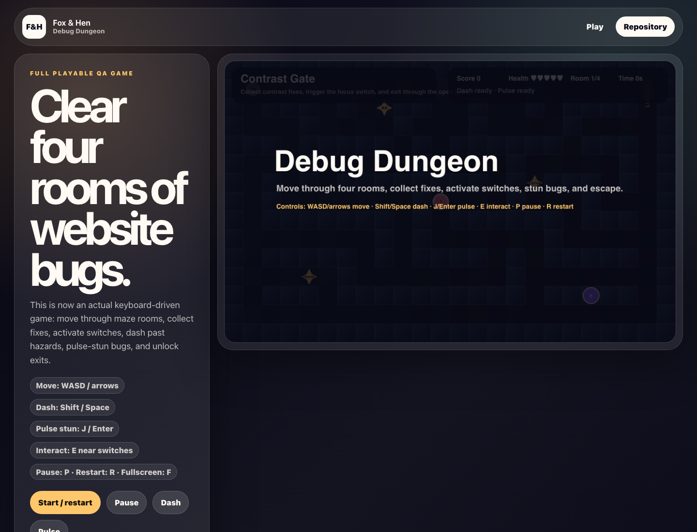

# Debug Dungeon

A fully playable Fox & Hen browser game where each dungeon room is a website bug to fix.



## Live Demo

- Demo: [https://foxhen-debug-dungeon.vercel.app](https://foxhen-debug-dungeon.vercel.app)
- Repository: [https://github.com/foxandhenllc/foxhen-debug-dungeon](https://github.com/foxandhenllc/foxhen-debug-dungeon)

## Fully Working Behaviors

- Four maze-style rooms with walls, exits, checkpoints, moving bug enemies, collectibles, switches, health, score, timer, win/loss states, and room progression.
- Keyboard controls for movement, dash, pulse stun, switch interaction, pause, restart, and fullscreen.
- Interface buttons for restart, pause/resume, dash, and pulse.
- Deterministic test hooks exposed as `window.render_game_to_text` and `window.advanceTime`.
- No backend, auth, external service calls, production data, or customer work.

## Controls

- Move: `WASD` or arrow keys
- Dash: `Shift` or `Space`
- Pulse stun: `J` or `Enter`
- Interact: `E` near switches
- Pause: `P`
- Restart: `R`
- Fullscreen: `F`

## Local Run

```bash
npm install
npm run dev
npm run build
```
